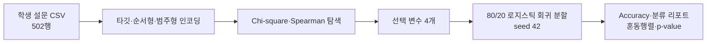

# 학생 우울 라벨 탐색 분류

[English](README.md)

> [프로젝트 자세히 보기](PORTFOLIO.ko.md)

502행 학생 설문 데이터로 우울 라벨과 생활·스트레스 변수의 관계를 탐색하는 비임상 분류 프로젝트입니다. 해석 가능한 경로를 유지하기 위해 선택한 네 변수를 로지스틱 회귀에 넣습니다.

> 이 프로젝트는 분석 탐색용입니다. 진단 도구가 아니며, 임상 판단이나 자동화된 고위험 의사결정에 사용하면 안 됩니다.

## 분석 흐름



## 구현한 방법

- `src/preprocessing.py`는 `Depression` 타깃, 순서형 3개, 범주형 5개를 인코딩합니다.
- `src/train.py`는 식습관, 자살사고 이력, 학업 압박, 재정 스트레스를 선택하고, scikit-learn 로지스틱 회귀와 statsmodels Logit을 함께 실행합니다.
- `src/generate_plots.py`는 Spearman, countplot, learning curve 그림을 만듭니다.

포함된 데이터와 설정된 시드로 2026-08-20에 다시 실행한 보관 결과는 **accuracy 0.9010**(테스트 101건), **weighted F1 0.90**, 혼동행렬 `[[42, 6], [4, 49]]`입니다. 자세한 값은 [`results/model_summary.txt`](results/model_summary.txt)에 있습니다. 이는 단일 holdout 결과일 뿐 외부 검증이나 임상 성능 추정치가 아닙니다.

## 보관된 시각 자료


*그림 1. 포함된 설문 데이터의 탐색적 상관입니다. 피처 검토에는 사용했지만 임상·인과 관계를 뜻하지는 않습니다.*


*그림 2. 한 설문 응답에 따른 라벨 분포를 서술적으로 보여 줍니다. 진단 규칙이 아닙니다.*

## 실행

```powershell
python src\preprocessing.py
python src\train.py
python src\generate_plots.py
```

`src/config.py`가 데이터 경로, 출력 디렉터리, 분할 비율, 시드, 선택 변수를 관리합니다.

## 문서

- [포트폴리오 사례 연구](PORTFOLIO.ko.md)
- [프로젝트 리뷰](docs/PROJECT_REVIEW.md)
- [아키텍처](docs/ARCHITECTURE.md)
