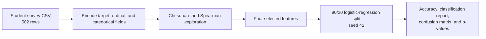
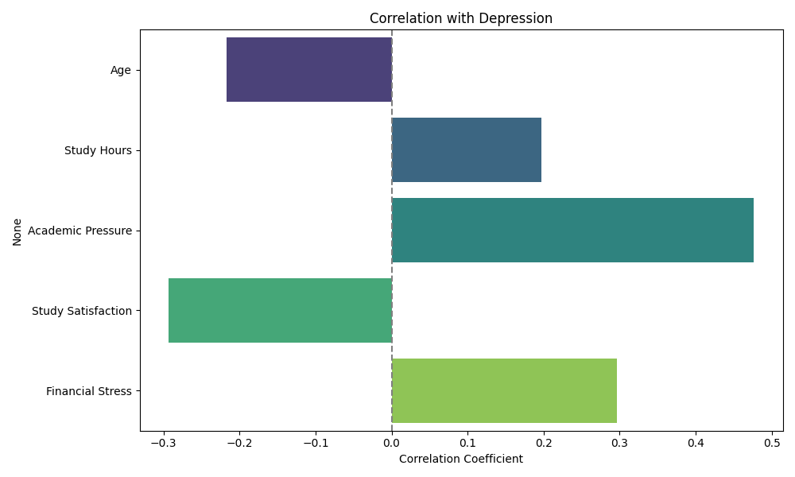
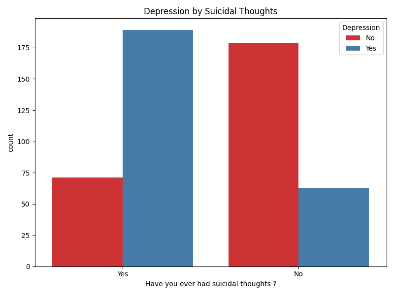
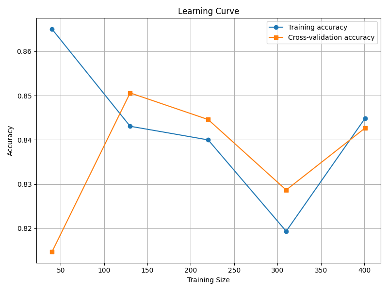

# Student Depression-Risk Classification

[한국어](README.ko.md)

> [Project details](PORTFOLIO.md)

An exploratory, non-clinical classification project using a 502-row student
survey dataset. The maintained model uses four selected lifestyle and stress
variables in logistic regression to keep the prediction path interpretable.

> This project is for analytical exploration only. It is not a diagnostic tool
> and must not be used for clinical or automated high-stakes decisions.

## Analysis flow



## Implemented method

- `src/preprocessing.py` encodes the `Depression` target, three ordinal fields,
  and five categorical fields.
- `src/train.py` selects dietary habits, suicidal-thought history, academic
  pressure, and financial stress; it fits scikit-learn logistic regression and
  a statsmodels Logit model for coefficient/p-value inspection.
- `src/generate_plots.py` produces Spearman, countplot, and learning-curve
  figures.

The maintained scripts were rerun on 2026-08-20 with the included data and
configured seed. The saved holdout result is **0.9010 accuracy** (101 test
records) and **0.90 weighted F1**; the confusion matrix is `[[42, 6], [4, 49]]`
([`results/model_summary.txt`](results/model_summary.txt)). This is a single
holdout result, not an external-validation or clinical-performance estimate.

## Retained visual evidence



*Figure 1. Exploratory correlations from the included survey data. These
associations informed feature review but do not establish clinical or causal
relationships.*



*Figure 2. Observed label distribution by one survey response. This chart is a
descriptive view of the study sample, not a diagnostic rule.*



*Figure 3. Training and cross-validation accuracy across training-set sizes.
It is a stability check for this small dataset, separate from the saved
101-record holdout result above.*

## Run

```powershell
python src\preprocessing.py
python src\train.py
python src\generate_plots.py
```

`src/config.py` centralizes the data path, output directory, split fraction,
seed, and selected features. `src/train.py` creates `results/` automatically.

## Documentation

- [Portfolio case study](PORTFOLIO.md)
- [Project review](docs/PROJECT_REVIEW.md)
- [Architecture](docs/ARCHITECTURE.md)
