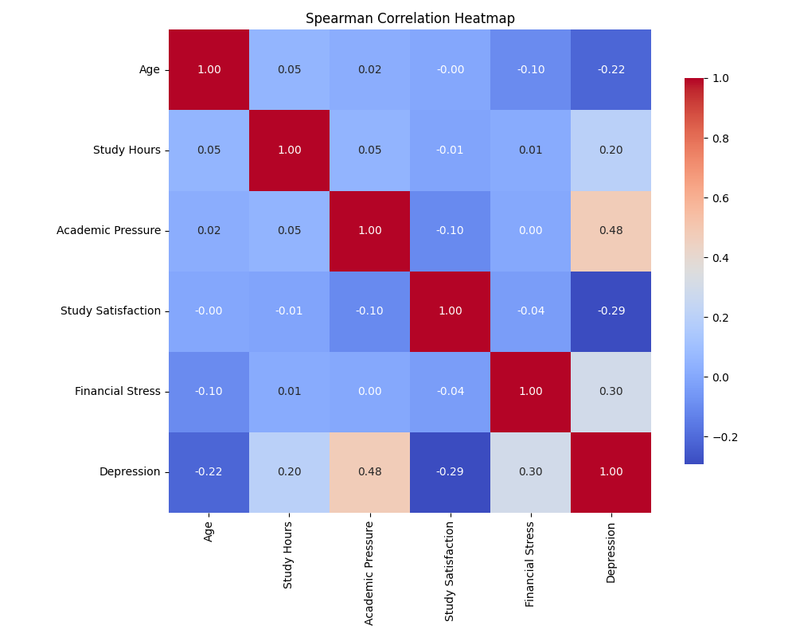
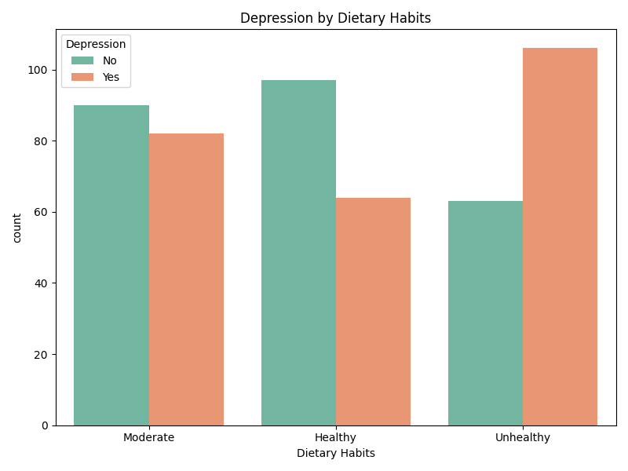

# 🧠 Depression Risk Prediction Model Development and Key Factor Analysis
*(우울증 위험 예측 모델 개발 및 주요 요인 분석)*

[](https://www.python.org/downloads/)
[](https://scikit-learn.org/)
[]()

This repository contains the project **"Depression Risk Prediction Model Development and Key Factor Analysis"**, which focuses on identifying critical lifestyle and stress factors contributing to depression among students and building a highly interpretable predictive model.

The study emphasizes a **Data-Centric and Inference-First approach**, using rigorous statistical validation to select features rather than relying on complex, black-box algorithms.

---

## 🚀 Executive Summary (TL;DR)
- **The Challenge**: Mental health issues among students are rising (WHO identifies it as a major cause of death for ages 15-29), but early identification typically requires lengthy clinical assessments. We need a lightweight, data-driven way to screen for high-risk individuals.
- **The Solution**: Conducted comprehensive statistical tests (Chi-Square for categorical, Spearman for ordinal) to filter non-obvious risk factors from a dataset of 502 students. Built a Logistic Regression model to maintain high explainability (p-values, odds ratios).
- **The Result**: 
  - Identified **Dietary Habits** ($p=0.0001$), **Suicidal Ideation** ($p<0.001$), **Academic Pressure** ($corr=0.48$), and **Financial Stress** ($corr=0.30$) as the most statistically significant predictors of depression risk.
  - Achieved a high test accuracy of **90.1%** and an F1-score of **90%**.
  - Quantified the impact: Suicidal Ideation had the highest positive coefficient (**3.16**), followed by Academic Pressure (**1.29**).


---

## 📌 1. Problem Definition (문제 정의)
- **Background**: Student depression is often dismissed as simple stress. However, lifestyle choices and environmental pressures act as measurable risk factors.
- **The Pitfall of Over-Modeling**: In small datasets (like the one used here with ~500 samples), using complex deep learning or boosting models without proper feature validation often leads to overfitting and lack of interpretability.
- **Vision**: To prove that **rigorous statistical feature selection combined with simple linear models** can provide better actionable insights for student counseling centers than complex black-box models.

---

## 🧠 2. Statistical Feature Validation (통계적 변수 검증)
The core philosophy of this project is to validate before modeling. We did not throw all variables into the model; we filtered them based on statistical significance.

### 📊 Categorical Analysis (Chi-Square Test)
We tested the dependency of Depression on categorical lifestyle factors:
- **Suicidal Thoughts**: Extremely high dependency ($p < 0.05$).
- **Dietary Habits**: Significant correlation with depression risk.
- **Gender & Sleep Duration**: Showed less direct linear dependency in this specific cohort.

### 📉 Ordinal Analysis (Spearman Correlation)
We measured the monotonic relationship between stress levels and depression:
- **Academic Pressure** and **Financial Stress** showed strong positive correlations with depression risk.

<div style="display: flex; justify-content: space-around;">
  
  
</div>
<br>

<div style="display: flex; justify-content: space-around;">
  
  
</div>
<br>

---

## 📈 3. Modeling & Interpretability (모델링 및 해석력)
We selected **Logistic Regression** as our primary algorithm to ensure that every prediction can be explained to non-technical stakeholders (e.g., school counselors).

- **Why Logistic Regression?**: It provides log-odds and p-values for each feature, allowing us to say exactly *how much* more likely a student is to develop depression if their financial stress increases.
- **Model Performance**: Accuracy = **90.1%**, Precision = **91%**, Recall = **90%**, F1-Score = **90%**.

### 📊 Key Feature Coefficients
- **Suicidal Ideation**: $coef = 3.1597, p < 0.001$ (Strongest predictor)
- **Academic Pressure**: $coef = 1.2947, p < 0.001$
- **Dietary Habits**: $coef = 0.7303, p < 0.001$

### 🔮 Simulation Cases (실제 예측 예시)
- **High Risk Student**: (Moderate diet, Suicidal thoughts, High academic & financial stress) $\rightarrow$ **88.6%** probability of depression.
- **Low Risk Student**: (Healthy diet, No suicidal thoughts, Low stress) $\rightarrow$ **1.9%** probability of depression.


---

## 📁 4. Repository Structure
```text
student_depression_prediction/
├── data/                  # Raw dataset (CSV)
├── docs/                  # Original research report (PDF)
├── notebooks/             # Exploratory Data Analysis & Prototyping (IPynb)
├── results/               # Model evaluation summaries
└── src/                   # Production-Ready Python Modules
    ├── preprocessing.py   # Data loading and encoding pipeline
    └── train.py           # Model training and statistical evaluation
```

---

## ⚙️ 5. How to Run
You can reproduce the statistical summary and model training using the provided scripts.
```bash
# 1. Preprocess data and verify encoding
python src/preprocessing.py

# 2. Train model and generate full statistical report
python src/train.py
```

---

## 👥 6. Contributors
- **Junhyung L.** (Project Lead)

---
*Refactored and polished to meet professional software engineering standards for the [Data Analyst Portfolio](https://github.com/junhyung-L/Resume/blob/main/Portfolio/README.md).*
